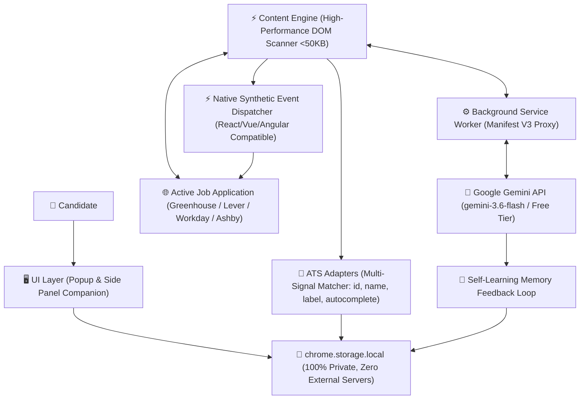

# 🚀 ApplyPilot AI — Universal Job Application Autofill & AI Copilot

[](https://developer.chrome.com/docs/extensions/mv3/intro/)
[](https://ai.google.dev/)
[-success.svg)]()
[]()
[](LICENSE)
[]()

> **ApplyPilot AI** is a lightweight, low-memory Chrome extension built to **10x career application speed** across Greenhouse, Lever, Workday, Ashby, and custom portals globally with **zero tracking**, **100% local storage**, and free Google Gemini AI.

---

## 🏗️ High-Level Architecture



---

## 🌟 Key Features

1. **⚡ 1-Click Multi-ATS Autofill**:
   - Out-of-the-box support for **Greenhouse, Lever, Workday, Ashby, SmartRecruiters**, and custom career sites worldwide.
   - Simulates native React, Vue, and Angular synthetic events so inputs don't revert to empty upon form submission.
2. **🧠 Self-Learning Feedback Loop**:
   - When a job application has a non-standard or unrecognized question, ApplyPilot detects it and generates a suggested answer via Gemini.
   - You review the suggestion in a quick pop-up card: **Approve & Remember**, or **Edit**.
   - Once approved, ApplyPilot fills the field **AND automatically remembers it** in your local memory dictionary. Next time that question appears on any job application, it autofills instantly!
3. **📄 Zero-Friction Resume Ingestion**:
   - Drag & drop your resume PDF directly or paste raw resume text.
   - Gemini AI parses your experience, education, skills, and links into your structured profile in seconds.
4. **✨ In-Field AI Essay Draft Button**:
   - On open-ended `<textarea>` prompts (*"Why our company?"*, *"Describe a technical challenge"*, *"Tell us about a time you solved a complex problem"*), an inline sparkle **"✨ AI Draft"** button appears.
   - 1 click writes a tailored, professional response using your real background and the job posting context.
5. **🏷️ Dynamic Custom Fields & Global Presets**:
   - Pre-configured with universal presets: Work Authorization (any country / location), Authorized Work Countries list, Visa Sponsorship, Notice Period (in days / weeks / months), and Flexible Salary / CTC (₹ INR LPA, $ USD, € EUR, £ GBP, etc.).
   - Add unlimited custom key-value pairs with keyword triggers.
6. **🚀 Lightweight & Low-RAM (<50KB DOM footprint)**:
   - Zero bulky frameworks or background polling loops. Does not slow down your browser even on low-memory systems (4GB - 8GB RAM).
7. **🔒 100% Private & Free Tier Powered**:
   - All profile data is stored **strictly on your computer** (`chrome.storage.local`).
   - Uses the official Google Gemini API (`gemini-3.6-flash`). Zero subscription fees.

---

## 🚀 How to Install in 10 Seconds

### Step 1: Open Chrome Extensions
1. Open Google Chrome, Brave, or Microsoft Edge.
2. In the URL bar, go to:
   ```text
   chrome://extensions
   ```
3. Enable **"Developer mode"** (toggle in the top-right corner).

### Step 2: Load the Extension
1. Click the **"Load unpacked"** button in the top-left corner.
2. Select the directory:
   ```text
   C:\Project\New folder
   ```
3. You will see **ApplyPilot AI — Smart Job Application Autofill** appear in your extension toolbar! Pin it for quick access.

---

## 🔑 Getting Your Free Gemini API Key (1-Minute Setup)

1. Go to [Google AI Studio](https://aistudio.google.com/app/apikey).
2. Sign in with your Google account.
3. Click **"Create API Key"** and copy the key (starts with `AIzaSy...`).
4. Click the **ApplyPilot AI** extension icon in your browser, go to the **⚙️ AI** tab, paste the key, and click **"Save Profile"**.
> *Note: The Gemini free tier provides 15 Requests Per Minute and 1,000,000 Tokens Per Minute, which is more than enough to fill hundreds of job applications every day for free.*

---

## 🧪 Testing the Extension (Instant Verification)

We have included a mock testing environment to verify autofill and reactive event dispatching without having to open a live job posting:

1. Double-click or open `test/test-forms.html` in Chrome.
2. You will see simulated **Greenhouse**, **Lever**, and **Workday** application forms.
3. Click the floating **"ApplyPilot Fill"** badge in the bottom-right corner (or open the extension popup and click "Autofill Application Now").
4. Watch all fields instantly populate and the live reactive event log record the input/change events!
5. Try the **"✨ AI Draft"** button on the technical challenge essay prompt to see Gemini craft a tailored response.

---

## 📁 Project Structure

```text
├── manifest.json              # Chrome Manifest V3 configuration
├── icons/                     # 16x16, 48x48, 128x128 extension icons
├── popup/
│   ├── popup.html             # Profile & quick-fill dashboard
│   ├── popup.css              # Modern UI styling
│   └── popup.js               # Tab logic, file uploader, storage controller
├── sidepanel/
│   ├── sidepanel.html         # Companion side panel for multi-step applications
│   ├── sidepanel.css          # Side panel styling
│   └── sidepanel.js           # Live tab observer & quick-copy drawer
├── content/
│   ├── content.js             # High-performance DOM scanner & feedback loop
│   ├── content.css            # Floating hub & review card styles
│   └── ats-adapters.js        # Multi-signal matcher for Greenhouse, Lever, Workday
├── background/
│   └── service-worker.js      # Ephemeral service worker, context menus, Gemini proxy
├── lib/
│   ├── storage.js             # Local profile store with universal defaults & presets
│   └── gemini-service.js      # Direct Gemini free-tier REST client
├── test/
│   ├── test-forms.html        # Interactive ATS simulation test suite
│   └── test-matcher.js        # Node.js automated unit verification (24/24 tests)
└── README.md                  # Documentation and user guide
```

---

## 💡 Pro-Tips for Job Hunting

- **Global Presets**: Configure your Salary/CTC (e.g. ₹25-35 LPA, $170k, €85k) and authorized work countries in the Presets tab. ApplyPilot fills these dynamically based on local portal requirements.
- **Side Panel Companion**: Click the side panel icon in the popup or right-click anywhere and choose *"Open ApplyPilot Side Panel"* to keep your candidate details and quick-copy drawer docked right next to Workday multi-step wizards!
- **Feedback Loop**: When an unusual question appears, click *"Scan Unrecognized Fields with AI"*. Review the generated answer, approve it, and ApplyPilot will remember it across all future job boards.

