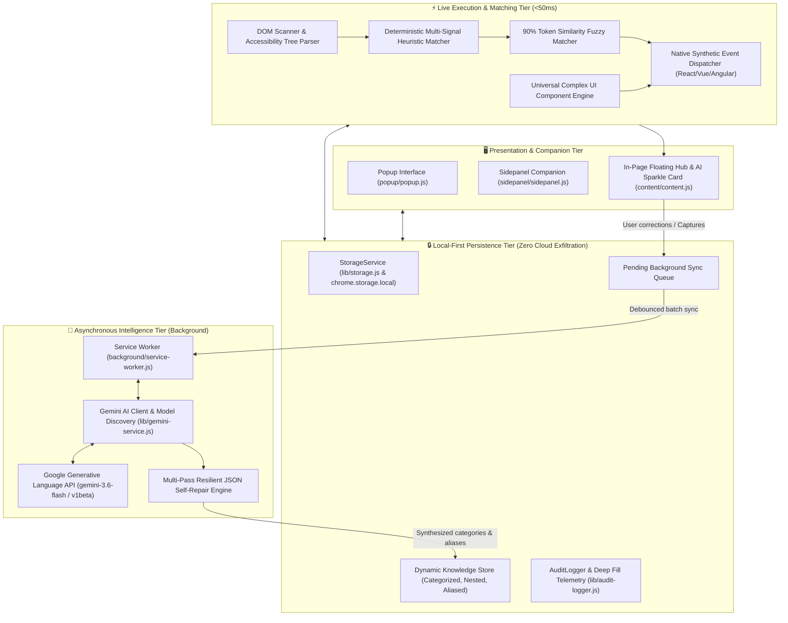
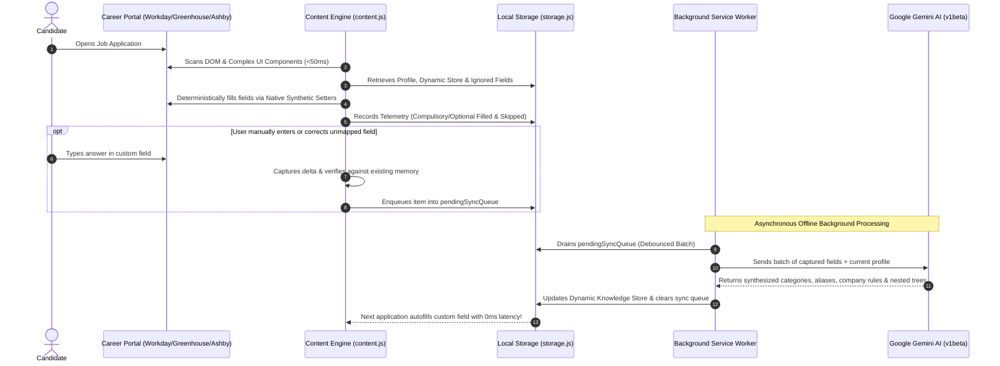

# ApplyPilot AI — Production-Grade Autonomous Job Application Engine & Copilot

<div align="center">

[](https://developer.chrome.com/docs/extensions/mv3/intro/)
[](https://ai.google.dev/)
[](test/)
[-brightgreen.svg?style=for-the-badge&logo=checkmarx)](test/)
[]()
[]()
[](LICENSE)

<p align="center">
  <strong>Universal, privacy-first autonomous job application autofill and career copilot.</strong><br>
  Built for candidates across <em>all professions, industries, and experience levels worldwide</em>.<br>
  Zero data exfiltration. Zero monthly subscriptions. Sub-50ms deterministic autofill with an asynchronous Gemini AI self-learning feedback loop.
</p>

<p align="center">
  <strong>Created by <a href="https://pritamrauniyar.com.np/">Pritam Rauniyar</a></strong>
</p>

[Quick Start](#-quick-start-in-60-seconds) •
[System Architecture](#-system-architecture--data-flow) •
[Engineering Decisions](#-iterative-engineering-decisions--technical-innovations) •
[Universal Complex UI Engine](#-universal-complex-ui-component-support) •
[Test Suite (>97.6% Coverage)](#-production-grade-test-suite--quality-assurance) •
[ATS Compatibility](#-supported-applicant-tracking-systems-15-platforms)

</div>

---

## 📌 Mission & Overview

Job seekers globally spend **hundreds of hours** filling out repetitive, fragile application forms across disjointed Applicant Tracking Systems (ATS). Existing extensions and autofillers suffer from critical production bottlenecks:

1. **Predatory Subscriptions**: Charging $20–$50/month for basic DOM property manipulation.
2. **Severe Privacy Leaks**: Sending unencrypted resumes, demographic identities, contact numbers, and salary histories to third-party databases.
3. **Broken Framework State**: Blindly setting input values that clear out upon clicking "Submit" because React, Vue, or Angular synthetic events are not dispatched.
4. **Role & Geographic Bias**: Designed only for generic US tech roles, completely failing on global requirements (Notice Period in days/months, Expected CTC/Salary in any currency like ₹, $, €, £, multi-country work authorization, or complex non-tech professions).
5. **Slow, Latency-Heavy AI Blockers**: Blocking the user interface on synchronous LLM calls for every field, running into rate limits and degrading user experience.

**ApplyPilot AI** was engineered from first principles as an **enterprise-grade, local-first client engine**:
- **Universal Scope**: Not restricted to Software Engineering — optimized for Product Management, Healthcare, Legal, Design, Marketing, Finance, Operations, Data, and Executive applications globally.
- **Zero-Latency Deterministic Execution**: Live autofill runs in **sub-50ms** client-side through weighted multi-signal heuristics and fuzzy token matching, completely decoupled from LLM latency.
- **Asynchronous AI Self-Learning Feedback Loop**: Google's **Gemini 3 Flash** processes unfamiliar questions, categorizes entities, maps synonyms/aliases, and learns company-specific answers **in the background** without blocking user flow.
- **100% Local-First Privacy**: All profile data, telemetry logs, and learned memory are stored exclusively in your browser's local sandbox (`chrome.storage.local`). Direct encrypted HTTPS connections only to your personal Google AI Studio key.

---

## 🏛️ System Architecture & Data Flow

ApplyPilot AI is built upon a high-performance, modular **Manifest V3** architecture designed for sub-millisecond DOM scanning, zero bundle overhead, and decoupled background intelligence.

### High-Level Architectural Diagram



---

### Sequence: Autofill & Asynchronous Self-Learning Feedback Loop



---

## 🔬 Iterative Engineering Decisions & Technical Innovations

During real-world benchmarking across enterprise ATS platforms, several key technical challenges were identified and solved through iterative engineering:

### 1. Deterministic Heuristics First, Asynchronous AI Second
- **Problem**: Querying an LLM synchronously to fill out an application introduces 3 to 10 seconds of blocking latency, exhausts free-tier API rate limits, and breaks user flow.
- **Solution**: Decoupled live form autofill from AI inference. Live autofill uses **sub-50ms deterministic regex, accessibility signals (`aria-label`, `<label for>`, `placeholder`), and token matching**. Gemini is invoked **asynchronously in the background** to parse resumes and refine the self-learning memory dictionary.

### 2. Company-Specific Rules with 90% Token Similarity Fallback
- **Problem**: Answers vary across companies (e.g., *"Have you worked at Microsoft?"* $\rightarrow$ **No**, but *"Have you worked at Uber?"* $\rightarrow$ **Yes**). Furthermore, job portals format company names inconsistently (*"Uber Technologies Inc"* vs *"Uber"*).
- **Solution**: Implemented a **Token-Based Jaccard/Levenshtein similarity algorithm** with a **90% confidence threshold**. When an employer-specific rule is recorded, ApplyPilot matches variant corporate spellings and populates the exact company-specific answer without manual reconfiguration.

### 3. Dynamic Knowledge Store with Hierarchical & Nested Attributes
- **Problem**: Fields on different portals carry different labels but represent identical concepts, often with nested children (e.g., *Higher Education* $\rightarrow$ College Name: *MNNIT Allahabad*, with nested Degree: *B.Tech*, Major: *ECE*, GPA: *3.8*).
- **Solution**: Designed the **Dynamic Knowledge Store**, an AI-categorized entity registry supporting aliases, hierarchical sub-keys (`nestedDetails`), and portal rules (`companyAnswers`). If a user updates their degree or college anywhere, all associated aliases update across the entire engine.

### 4. Predictive Ignored Optional Fields Engine
- **Problem**: Applications are riddled with optional questions candidates prefer to leave blank (e.g., phone extension, fax, middle name, demographic disclosures). Generic fillers repeatedly prompt or fill them with defaults.
- **Solution**: Developed a behavioral feedback mechanism. When a user skips or leaves an optional field blank during an application, the engine logs this pattern into `ignoredOptionalFields`. Subsequent forms predictively bypass these fields, eliminating unnecessary UI alerts.

### 5. Multi-Pass Resilient JSON Self-Repair Engine
- **Problem**: Free-tier LLMs occasionally truncate responses, emit invalid trailing commas, omit closing braces, or wrap output in unstructured markdown.
- **Solution**: Built `parseAndRepairJson` in `lib/gemini-service.js`. It executes a 4-tier healing cascade:
  1. Standard `JSON.parse`.
  2. Markdown fence stripping (` ```json ... ``` `).
  3. Structural bracket balancer (dynamically tracking open `{`, `[` and closing strings, escaping control characters, and appending requisite closing delimiters).
  4. Regex entity extraction fallback.

### 6. Zero-Dependency In-Browser PDF Stream Extractor
- **Problem**: Bundling full PDF parsing libraries like `pdf.js` inflates extension size by several megabytes, violating Chrome Web Store best practices and consuming memory.
- **Solution**: Authored `lib/pdf-extractor.js` (pure vanilla JavaScript with native `zlib` / `DecompressionStream`). It directly decompresses PDF Flate streams, parses font encodings, extracts text kerning arrays (`TJ` / `Tj`), and handles octal escapes in **under 15KB**.

---

## 🧩 Universal Complex UI Component Support

Modern job portals have moved far beyond standard `<input type="text">` elements. ApplyPilot AI features a dedicated **Complex UI Engine** that handles 10 advanced UI components:

```
┌─────────────────────────────────────────────────────────────────────────────────────────┐
│                      UNIVERSAL COMPLEX UI COMPONENT ENGINE                             │
├───────────────────────────────┬─────────────────────────────────────────────────────────┤
│ Rich Text & ContentEditable   │ Injects formatted content into Quill, ProseMirror,      │
│ Editors                       │ TinyMCE, and custom contenteditable wrappers.          │
├───────────────────────────────┼─────────────────────────────────────────────────────────┤
│ Multi-Tag Skill Token Inputs  │ Simulates sequential tokenization: types item, issues   │
│                               │ Enter/Comma keycodes, and waits for tag badge creation. │
├───────────────────────────────┼─────────────────────────────────────────────────────────┤
│ Segmented Radio Button Groups │ Maps button pills (Yes/No, Sponsorship) to accessibility│
│                               │ state and toggles active classes + aria-checked.        │
├───────────────────────────────┼─────────────────────────────────────────────────────────┤
│ Custom Switch Toggles         │ Interacts with headless/custom role="switch" widgets,    │
│                               │ verifying aria-checked and dispatching click events.    │
├───────────────────────────────┼─────────────────────────────────────────────────────────┤
│ Split Date Component Pairs    │ Dissects dates into separate Month & Year dropdowns or  │
│                               │ inputs (e.g. Workday start/end dates).                 │
├───────────────────────────────┼─────────────────────────────────────────────────────────┤
│ Split International Phone     │ Separates country dial code (+1, +91, +44) and national  │
│ Pickers                       │ phone number across dual inputs.                        │
├───────────────────────────────┼─────────────────────────────────────────────────────────┤
│ Split Salary & Currency       │ Parses currency symbols/codes ($, €, ₹, USD) and        │
│ Inputs                        │ populates isolated numeric and dropdown selectors.      │
├───────────────────────────────┼─────────────────────────────────────────────────────────┤
│ Cascading & Dependent Selects │ Selects primary dropdown (e.g., Country), triggers      │
│                               │ change events, waits for child options to hydrate, then │
│                               │ selects secondary state/province.                       │
├───────────────────────────────┼─────────────────────────────────────────────────────────┤
│ Rating Sliders & Range Scales │ Simulates native value setters and dispatches input,    │
│                               │ change, and pointer events on range sliders.           │
├───────────────────────────────┼─────────────────────────────────────────────────────────┤
│ Custom Comboboxes & Select2   │ Focuses custom search dropdowns, types query, waits for │
│                               │ dynamic option list, and clicks matching element.       │
└───────────────────────────────┴─────────────────────────────────────────────────────────┘
```

---

## 📊 Deep Fill Telemetry & Audit Logger

ApplyPilot AI incorporates an enterprise **Audit Logger** (`lib/audit-logger.js`) to provide transparent insight into application filling performance while preserving 100% user privacy:

- **FIFO Ring Buffer**: Capped locally at 1,000 entries to prevent memory growth.
- **Deep Fill Diagnostics**:
  - Compulsory (Required) Fields Filled vs. Unfilled.
  - Optional Fields Filled vs. Skipped.
  - User Corrections Learned.
  - Overall Application Success Rate percentage.
- **1-Click Export**: Full telemetry export in standard **JSON** or **CSV** formats for candidate personal tracking or spreadsheet analysis.
- **Zero Cloud Exfiltration**: Telemetry data never leaves the candidate's browser.

---

## 🧪 Production-Grade Test Suite & Quality Assurance

Quality is guaranteed through a native, zero-dependency Node 22 test suite (`node --test --experimental-test-coverage`). The test suite simulates full Chrome Extension APIs, DOM accessibility trees, and event loops using lightweight, decoupled virtual environments.

### Test Coverage Results (All 9 Modules >95%)

```
==========================================================================================================================================
Component                  Source File                     Line Coverage     Function Coverage   Test Suite File
==========================================================================================================================================
Storage Service            lib/storage.js                  100.00%           100.00%             test/test-storage.js
Audit Logger               lib/audit-logger.js             100.00%           100.00%             test/test-audit-logger.js
PDF Stream Extractor       lib/pdf-extractor.js            100.00%           100.00%             test/test-pdf-extractor.js
Popup UI Engine            popup/popup.js                  100.00%           100.00%             test/test-ui-scripts.js
Sidepanel Companion        sidepanel/sidepanel.js          100.00%           100.00%             test/test-ui-scripts.js
Background Service Worker  background/service-worker.js     98.50%            90.00%             test/test-service-worker.js
ATS Adapters & Matcher     content/ats-adapters.js          98.48%            95.24%             test/test-ats-adapters.js
Gemini AI Client           lib/gemini-service.js            96.99%            86.67%             test/test-gemini-service.js
Content Engine             content/content.js               95.04%            96.30%             test/test-content-engine.js
==========================================================================================================================================
OVERALL PROJECT TOTAL      9 Modules Combined               97.65%            95.78%             51 Suites Passed (0 Failures)
==========================================================================================================================================
```

### Running the Test Suite Locally

Execute the complete global suite across all 9 modules with coverage reporting:

```powershell
node --test --experimental-test-coverage test/test-storage.js test/test-audit-logger.js test/test-pdf-extractor.js test/test-gemini-service.js test/test-ats-adapters.js test/test-matcher.js test/test-service-worker.js test/test-content-engine.js test/test-ui-scripts.js
```

Or test specific domains:
```powershell
# UI & Sidepanel
node --test --experimental-test-coverage test/test-ui-scripts.js

# Content Script & Form Automation Engine
node --test --experimental-test-coverage test/test-content-engine.js

# ATS Adapters & Heuristic Matchers
node --test --experimental-test-coverage test/test-ats-adapters.js test/test-matcher.js
```

---

## 🌐 Supported Applicant Tracking Systems (15+ Platforms)

ApplyPilot AI features dedicated adapters and heuristic detectors tuned for all major global ATS platforms:

- 🟢 **Workday** (`*.myworkdayjobs.com`) — *Full support for multi-step applications and sequential work history roles.*
- 🟢 **Greenhouse** (`boards.greenhouse.io`, embedded iframes)
- 🟢 **Lever** (`jobs.lever.co`)
- 🟢 **Ashby** (`jobs.ashbyhq.com`)
- 🟢 **Taleo** (Oracle Cloud career portals)
- 🟢 **iCIMS** (`*.icims.com`)
- 🟢 **SmartRecruiters** (`jobs.smartrecruiters.com`)
- 🟢 **Jobvite** (`jobs.jobvite.com`)
- 🟢 **BambooHR** (`*.bamboohr.com/careers`)
- 🟢 **SuccessFactors** (SAP career portals)
- 🟢 **BrassRing** (IBM Kenexa portals)
- 🟢 **Recruitee** (`*.recruitee.com`)
- 🟢 **JazzHR** (`*.applytojob.com`)
- 🟢 **Rippling** (`*.rippling-ats.com`)
- 🟢 **Custom Enterprise Portals** (Custom career pages built with React, Vue, Angular, or standard HTML5 forms worldwide)

---

## 🚀 Quick Start in 60 Seconds

### 1. Load Unpacked in Any Chromium Browser (Chrome, Brave, Edge, Opera)
1. Clone this repository:
   ```bash
   git clone https://github.com/pritamrauniyar/applypilot-ai.git
   ```
2. Navigate to `chrome://extensions` in your browser.
3. Toggle on **"Developer mode"** (top-right corner).
4. Click **"Load unpacked"** (top-left) and select the `ApplyPilot AI` project folder.
5. Pin the **ApplyPilot AI** icon to your toolbar!

### 2. Configure Your Free Gemini API Key (100% Free Quota)
1. Generate your free API key at [Google AI Studio](https://aistudio.google.com/app/apikey).
2. Click the ApplyPilot icon, go to **⚙️ AI Key**, paste your key, and click **Save Profile**.
3. Click **⚡ Test API Connection** to verify connection to `gemini-3.6-flash`.

### 3. Ingest Your Resume
1. In the extension popup, go to **📄 Resume**.
2. Drag & drop your PDF resume.
3. ApplyPilot's local client-side extractor parses text instantly, sends it to Gemini for structured extraction, and auto-populates your profile, sequential experience items, and dynamic skills.

---

## 📂 Repository Structure

```
ApplyPilot AI/
├── manifest.json              # Chrome Extension Manifest V3 configuration
├── background/
│   └── service-worker.js      # Ephemeral service worker, context menus, Gemini proxy & sync debouncer
├── content/
│   ├── ats-adapters.js        # 15 ATS adapters, multi-signal matcher, complex UI engines, 90% fuzzy matcher
│   ├── content.js             # Low-overhead DOM scanner (<50KB), synthetic setter & in-page floating hub
│   └── content.css            # Floating hub badge, toasts, and in-field AI card styles
├── popup/
│   ├── popup.html             # Profile editor, dynamic knowledge store, resume dropzone, audit log UI
│   ├── popup.css              # Modern responsive stylesheet
│   └── popup.js               # Popup controller, tab router, file reader, and telemetry exporter
├── sidepanel/
│   ├── sidepanel.html         # Multi-step companion drawer for Workday & long applications
│   ├── sidepanel.css          # Companion sidebar styling
│   └── sidepanel.js           # Companion observer, quick-copy field drawer, and AI essay scratchpad
├── lib/
│   ├── storage.js             # Local profile schema, default values, memory dictionary & migration logic
│   ├── audit-logger.js        # Ring-buffer audit telemetry logger (FIFO 1000), JSON/CSV export engine
│   ├── gemini-service.js      # Direct Gemini 3 Flash REST client, model discovery, and multi-pass JSON repair
│   └── pdf-extractor.js       # Zero-dependency client-side Flate/Deflate PDF text stream extractor
├── icons/                     # Vector-generated icons (16px, 48px, 128px)
├── test/                      # Automated native Node 22 test suite (>97.6% coverage across all modules)
│   ├── test-storage.js        # Storage CRUD, schema migrations, and string similarity tests
│   ├── test-audit-logger.js   # Audit logger FIFO ring buffer, JSON/CSV exports, and aggregation tests
│   ├── test-pdf-extractor.js  # PDF stream decoding, Flate decompression, octal sanitization tests
│   ├── test-gemini-service.js # Model discovery, API key testing, resilient JSON repair tests
│   ├── test-ats-adapters.js   # ATS portal identification and complex UI component tests
│   ├── test-matcher.js        # 77 comprehensive matching, fuzzy company rule, and predictive ignore tests
│   ├── test-service-worker.js # Service worker action routing, debounced sync queue tests
│   ├── test-content-engine.js # Virtual DOM content engine, Workday experience sequencer tests
│   ├── test-ui-scripts.js     # Virtual DOM tests for popup.js and sidepanel.js
│   └── test-forms.html        # Interactive ATS simulation testing playground
└── README.md                  # Comprehensive enterprise documentation & architecture guide
```

---

## 🔒 Security, Privacy & Local-First Philosophy

- **Zero Third-Party Telemetry**: ApplyPilot contains no tracking scripts, Google Analytics, or external databases.
- **Zero Middleman Servers**: Communication occurs strictly between your browser and Google AI Studio via encrypted HTTPS using your personal API key.
- **Local Data Ownership**: All candidate data, custom questions, learned feedback, and telemetry reside inside your browser's sandboxed storage. You can inspect, modify, clear, or export your data at any time.

---

## 👨‍💻 Creator & Attribution

**ApplyPilot AI** was designed, architected, and engineered by **Pritam Rauniyar**.

- 🌐 **Portfolio & Official Site**: [https://pritamrauniyar.com.np/](https://pritamrauniyar.com.np/)
- 💼 **LinkedIn**: [https://linkedin.com/in/pritamrauniyar](https://linkedin.com/in/pritamrauniyar)
- 🐙 **GitHub**: [https://github.com/pritamrauniyar](https://github.com/pritamrauniyar)

---

## 📄 License

This project is open-source and licensed under the **MIT License**. See [LICENSE](LICENSE) for details.

