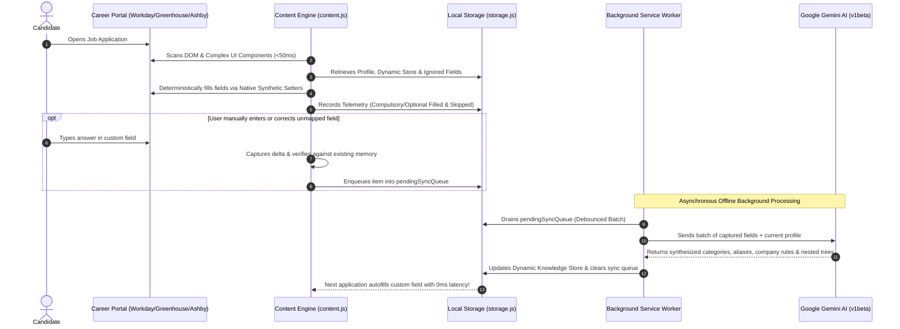

# ApplyPilot AI — Production-Grade Autonomous Job Application Engine & Copilot

<div align="center">

[](https://developer.chrome.com/docs/extensions/mv3/intro/)
[-4285F4.svg?style=for-the-badge&logo=googlegemini)](https://ai.google.dev/)
[](test/)
[](test/)
[](PRIVACY.md)
[]()
[](LICENSE)

<p align="center">
  <strong>Universal, privacy-first autonomous job application autofill and career copilot.</strong><br>
  Built for candidates across <em>all professions, industries, and experience levels worldwide</em>.<br>
  No ApplyPilot servers, no subscriptions. Deterministic local autofill, with an optional
  asynchronous Gemini feedback loop that runs only on your own API key.<br>
  <a href="PRIVACY.md">Read exactly what is stored and what is sent &rarr;</a>
</p>

<p align="center">
  <strong>Created by <a href="https://pritamrauniyar.com.np/">Pritam Rauniyar</a></strong>
</p>

[Quick Start](#-quick-start-in-60-seconds) •
[System Architecture](#-system-architecture--data-flow) •
[Engineering Decisions](#-iterative-engineering-decisions--technical-innovations) •
[Universal Complex UI Engine](#-universal-complex-ui-component-support) •
[Test Suite (>97.6% Coverage)](#-production-grade-test-suite--quality-assurance) •
[ATS Compatibility](#-supported-applicant-tracking-systems-15-platforms)

</div>

---

## 📌 Mission & Overview

Job seekers globally spend **hundreds of hours** filling out repetitive, fragile application forms across disjointed Applicant Tracking Systems (ATS). Existing extensions and autofillers suffer from critical production bottlenecks:

1. **Predatory Subscriptions**: Charging $20–$50/month for basic DOM property manipulation.
2. **Severe Privacy Leaks**: Sending unencrypted resumes, demographic identities, contact numbers, and salary histories to third-party databases.
3. **Broken Framework State**: Blindly setting input values that clear out upon clicking "Submit" because React, Vue, or Angular synthetic events are not dispatched.
4. **Role & Geographic Bias**: Designed only for generic US tech roles, completely failing on global requirements (Notice Period in days/months, Expected CTC/Salary in any currency like ₹, $, €, £, multi-country work authorization, or complex non-tech professions).
5. **Slow, Latency-Heavy AI Blockers**: Blocking the user interface on synchronous LLM calls for every field, running into rate limits and degrading user experience.

**ApplyPilot AI** was engineered from first principles as an **enterprise-grade, local-first client engine**:
- **Universal Scope**: Not restricted to Software Engineering — optimized for Product Management, Healthcare, Legal, Design, Marketing, Finance, Operations, Data, and Executive applications globally.
- **Zero-Latency Deterministic Execution**: Live autofill runs in **sub-50ms** client-side through weighted multi-signal heuristics and fuzzy token matching, completely decoupled from LLM latency.
- **Asynchronous AI Self-Learning Feedback Loop**: Your chosen **Gemini** model processes unfamiliar questions, categorizes entities, maps synonyms/aliases, and learns company-specific answers **in the background** without blocking user flow.
- **Local-First Storage**: Profile data, activity logs, and learned memory are stored exclusively in your browser's local sandbox (`chrome.storage.local`). There is no ApplyPilot server and no account.
- **One External Destination, Under Your Control**: AI features call Google's Generative Language API directly, authenticated with *your* key. That means resume text, the question being answered, and relevant profile context do leave your browser when you use them — see [PRIVACY.md](PRIVACY.md) for the exact payloads. Configure no key and the extension makes no network requests at all.
- **Sensitive Fields Are Off-Limits**: ID numbers, dates of birth, bank and card details, salary history and passwords are never read, stored, logged, or transmitted — regardless of settings.

---

## 🏛️ System Architecture & Data Flow

ApplyPilot AI is built upon a high-performance, modular **Manifest V3** architecture designed for sub-millisecond DOM scanning, zero bundle overhead, and decoupled background intelligence.

### High-Level Architectural Diagram


---

### Sequence: Autofill & Asynchronous Self-Learning Feedback Loop



---

## 🔬 Iterative Engineering Decisions & Technical Innovations

During real-world benchmarking across enterprise ATS platforms, several key technical challenges were identified and solved through iterative engineering:

### 1. Deterministic Heuristics First, Asynchronous AI Second
- **Problem**: Querying an LLM synchronously to fill out an application introduces 3 to 10 seconds of blocking latency, exhausts free-tier API rate limits, and breaks user flow.
- **Solution**: Decoupled live form autofill from AI inference. Live autofill uses **sub-50ms deterministic regex, accessibility signals (`aria-label`, `<label for>`, `placeholder`), and token matching**. Gemini is invoked **asynchronously in the background** to parse resumes and refine the self-learning memory dictionary.

### 2. Company-Specific Rules with 90% Token Similarity Fallback
- **Problem**: Answers vary across companies (e.g., *"Have you worked at Microsoft?"* $\rightarrow$ **No**, but *"Have you worked at Uber?"* $\rightarrow$ **Yes**). Furthermore, job portals format company names inconsistently (*"Uber Technologies Inc"* vs *"Uber"*).
- **Solution**: Implemented a **Token-Based Jaccard/Levenshtein similarity algorithm** with a **90% confidence threshold**. When an employer-specific rule is recorded, ApplyPilot matches variant corporate spellings and populates the exact company-specific answer without manual reconfiguration.

### 3. Dynamic Knowledge Store with Hierarchical & Nested Attributes
- **Problem**: Fields on different portals carry different labels but represent identical concepts, often with nested children (e.g., *Higher Education* $\rightarrow$ College Name: *MNNIT Allahabad*, with nested Degree: *B.Tech*, Major: *ECE*, GPA: *3.8*).
- **Solution**: Designed the **Dynamic Knowledge Store**, an AI-categorized entity registry supporting aliases, hierarchical sub-keys (`nestedDetails`), and portal rules (`companyAnswers`). If a user updates their degree or college anywhere, all associated aliases update across the entire engine.

### 4. Predictive Ignored Optional Fields Engine
- **Problem**: Applications are riddled with optional questions candidates prefer to leave blank (e.g., phone extension, fax, middle name, demographic disclosures). Generic fillers repeatedly prompt or fill them with defaults.
- **Solution**: Developed a behavioral feedback mechanism. When a user skips or leaves an optional field blank during an application, the engine logs this pattern into `ignoredOptionalFields`. Subsequent forms predictively bypass these fields, eliminating unnecessary UI alerts.

### 5. Multi-Pass Resilient JSON Self-Repair Engine
- **Problem**: Free-tier LLMs occasionally truncate responses, emit invalid trailing commas, omit closing braces, or wrap output in unstructured markdown.
- **Solution**: Built `parseAndRepairJson` in `lib/gemini-service.js`. It executes a 4-tier healing cascade:
  1. Standard `JSON.parse`.
  2. Markdown fence stripping (` ```json ... ``` `).
  3. Structural bracket balancer (dynamically tracking open `{`, `[` and closing strings, escaping control characters, and appending requisite closing delimiters).
  4. Regex entity extraction fallback.

### 6. Zero-Dependency In-Browser PDF Stream Extractor
- **Problem**: Bundling full PDF parsing libraries like `pdf.js` inflates extension size by several megabytes, violating Chrome Web Store best practices and consuming memory.
- **Solution**: Authored `lib/pdf-extractor.js` (pure vanilla JavaScript with native `zlib` / `DecompressionStream`). It directly decompresses PDF Flate streams, parses font encodings, extracts text kerning arrays (`TJ` / `Tj`), and handles octal escapes in **under 15KB**.

### 7. Universal Hierarchical Parent-Context Engine (Parent Key + Child Key)
- **Problem**: Ambiguous or repeating sub-fields (e.g., `roleDescription`, `title`, `company`, `school`, `degree`, `startDate`, `endDate`) across repeated sections (`Work Experience 1..N`, `Education 1..N`, `Projects 1..N`) can cause collisions, cross-section overwrites, or generic matching errors.
- **Solution**: Implemented a **Universal Hierarchical Scope Engine**. The content engine detects the surrounding semantic container (`detectParentScope`), associates every modified or matched child field with its parent (`parentScope` + `childKey`), and stores values under partitioned sub-keys (`dynamicFields.nestedDetails[parentScope][childKey]`) while synchronizing sequential item arrays (`experience.items[i]`, `education.items[i]`).

### 8. Persistent Memory for User-Cleared Fields
- **Problem**: When a user completely deletes an autofilled value (such as clearing an erroneously matched Middle Name or removing an unwanted answer), standard change listeners ignore empty strings, causing the extension to stubbornly re-fill the removed text on subsequent visits.
- **Solution**: Engineered a real-time erasure detection interceptor (`handleUserClearedField`). When an autofilled or previously populated field is emptied, the engine captures the blank state, immediately clears the corresponding key from persistent storage (`profile.personal.middleName`, `nestedDetails`, `learnedMemory`), records a skipped field interaction, and increments predictive ignore confidence so it is never filled again.

### 9. Resume Objective & Role Description Boundary Isolation
- **Problem**: Multi-page resumes frequently contain career summaries or objectives at the top that naive parsers dump into the first work experience's `roleDescription` or `jobDescription`.
- **Solution**: Enforced strict boundary rules in the Gemini parsing schema and normalization layer. General candidate objectives map exclusively to `experience.headline`. If a specific company role does not contain explicit work bullet points in the resume, its `description` is strictly left as an empty string (`""`), allowing the candidate to fill it on demand with automated hierarchical persistence.

---

## 🧩 Universal Complex UI Component Support

Modern job portals have moved far beyond standard `<input type="text">` elements. ApplyPilot AI features a dedicated **Complex UI Engine** that handles 10 advanced UI components:

```
┌─────────────────────────────────────────────────────────────────────────────────────────┐
│                      UNIVERSAL COMPLEX UI COMPONENT ENGINE                             │
├───────────────────────────────┬─────────────────────────────────────────────────────────┤
│ Rich Text & ContentEditable   │ Injects formatted content into Quill, ProseMirror,      │
│ Editors                       │ TinyMCE, and custom contenteditable wrappers.          │
├───────────────────────────────┼─────────────────────────────────────────────────────────┤
│ Multi-Tag Skill Token Inputs  │ Simulates sequential tokenization: types item, issues   │
│                               │ Enter/Comma keycodes, and waits for tag badge creation. │
├───────────────────────────────┼─────────────────────────────────────────────────────────┤
│ Segmented Radio Button Groups │ Maps button pills (Yes/No, Sponsorship) to accessibility│
│                               │ state and toggles active classes + aria-checked.        │
├───────────────────────────────┼─────────────────────────────────────────────────────────┤
│ Custom Switch Toggles         │ Interacts with headless/custom role="switch" widgets,    │
│                               │ verifying aria-checked and dispatching click events.    │
├───────────────────────────────┼─────────────────────────────────────────────────────────┤
│ Split Date Component Pairs    │ Dissects dates into separate Month & Year dropdowns or  │
│                               │ inputs (e.g. Workday start/end dates).                 │
├───────────────────────────────┼─────────────────────────────────────────────────────────┤
│ Split International Phone     │ Separates country dial code (+1, +91, +44) and national  │
│ Pickers                       │ phone number across dual inputs.                        │
├───────────────────────────────┼─────────────────────────────────────────────────────────┤
│ Split Salary & Currency       │ Parses currency symbols/codes ($, €, ₹, USD) and        │
│ Inputs                        │ populates isolated numeric and dropdown selectors.      │
├───────────────────────────────┼─────────────────────────────────────────────────────────┤
│ Cascading & Dependent Selects │ Selects primary dropdown (e.g., Country), triggers      │
│                               │ change events, waits for child options to hydrate, then │
│                               │ selects secondary state/province.                       │
├───────────────────────────────┼─────────────────────────────────────────────────────────┤
│ Rating Sliders & Range Scales │ Simulates native value setters and dispatches input,    │
│                               │ change, and pointer events on range sliders.           │
├───────────────────────────────┼─────────────────────────────────────────────────────────┤
│ Custom Comboboxes & Select2   │ Focuses custom search dropdowns, types query, waits for │
│                               │ dynamic option list, and clicks matching element.       │
└───────────────────────────────┴─────────────────────────────────────────────────────────┘
```

---

## 📊 Deep Fill Telemetry & Audit Logger

ApplyPilot AI incorporates an enterprise **Audit Logger** (`lib/audit-logger.js`) to provide transparent insight into application filling performance while preserving 100% user privacy:

- **FIFO Ring Buffer**: Capped locally at 1,000 entries to prevent memory growth.
- **Deep Fill Diagnostics**:
  - Compulsory (Required) Fields Filled vs. Unfilled.
  - Optional Fields Filled vs. Skipped.
  - User Corrections Learned.
  - Overall Application Success Rate percentage.
- **1-Click Export**: Full telemetry export in standard **JSON** or **CSV** formats for candidate personal tracking or spreadsheet analysis.
- **Local Telemetry**: The activity log is stored only in your browser and is never sent anywhere. Field values in it are masked unless you opt in. The separate background knowledge compiler *does* send your saved answers and corrections to Google's API when enabled — turn it off in Settings → Privacy to keep learning fully on-device.

---

## 🧪 Test Suite & Quality Assurance

A native, zero-dependency Node test suite (`node --test`) covering all nine modules.
Chrome extension APIs, the DOM, and the network layer are simulated with lightweight
in-process mocks.

**Current status: 73/73 tests passing, 95.98% line coverage / 94.12% function coverage.**

### Running the Test Suite

```bash
npm test              # run everything
npm run coverage      # run with the V8 coverage report
npm run lint          # ESLint across all runtime targets
npm run check         # lint + test
```

Run a single suite:

```bash
node --test test/test-storage.js
node --test test/test-content-engine.js
node --test "test/test-ats-adapters.js" "test/test-matcher.js"
```

> On Windows, quote the glob (`node --test "test/*.js"`) — an unquoted `test/` directory
> argument is not expanded and will fail to resolve.

### Coverage by Module

| Module | Source | Line | Branch | Func |
|---|---|---|---|---|
| Sidepanel Companion | `sidepanel/sidepanel.js` | 100.00% | 58.57% | 100.00% |
| Audit Logger | `lib/audit-logger.js` | 97.61% | 94.90% | 93.33% |
| Storage Service | `lib/storage.js` | 97.57% | 79.01% | 90.91% |
| Popup UI Engine | `popup/popup.js` | 96.52% | 61.22% | 97.67% |
| PDF Stream Extractor | `lib/pdf-extractor.js` | 96.12% | 86.67% | 100.00% |
| ATS Adapters & Matcher | `content/ats-adapters.js` | 95.81% | 78.99% | 90.00% |
| Content Engine | `content/content.js` | 92.80% | 65.60% | 93.06% |
| Gemini AI Client | `lib/gemini-service.js` | 91.40% | 56.76% | 85.29% |
| Background Service Worker | `background/service-worker.js` | 90.08% | 74.56% | 90.00% |
| **Overall** | **9 modules** | **95.98%** | **75.08%** | **94.12%** |

### Known Testing Limitations

Being honest about what these numbers do and do not prove:

- **Branch coverage is 75%**, well below line coverage. Error and fallback paths are the least exercised.
- **The suite is fully self-mocked.** It validates internal logic against hand-written DOM and Chrome API stubs — not against real Greenhouse, Lever, Workday or Ashby markup. Adapter changes should still be verified manually against a live form.
- **No end-to-end browser tests.** There is no Puppeteer/Playwright layer driving a real Chrome instance.
- **The PDF extractor is a heuristic stream parser**, not a full PDF implementation. It handles FlateDecode with PNG predictors and `/ToUnicode` CMaps, but scanned/raster PDFs and exotic encodings still fall back to the "paste resume text" path.

---

## 🌐 Supported Applicant Tracking Systems (15+ Platforms)

ApplyPilot AI features dedicated adapters and heuristic detectors tuned for all major global ATS platforms:

- 🟢 **Workday** (`*.myworkdayjobs.com`) — *Full support for multi-step applications and sequential work history roles.*
- 🟢 **Greenhouse** (`boards.greenhouse.io`, embedded iframes)
- 🟢 **Lever** (`jobs.lever.co`)
- 🟢 **Ashby** (`jobs.ashbyhq.com`)
- 🟢 **Taleo** (Oracle Cloud career portals)
- 🟢 **iCIMS** (`*.icims.com`)
- 🟢 **SmartRecruiters** (`jobs.smartrecruiters.com`)
- 🟢 **Jobvite** (`jobs.jobvite.com`)
- 🟢 **BambooHR** (`*.bamboohr.com/careers`)
- 🟢 **SuccessFactors** (SAP career portals)
- 🟢 **BrassRing** (IBM Kenexa portals)
- 🟢 **Recruitee** (`*.recruitee.com`)
- 🟢 **JazzHR** (`*.applytojob.com`)
- 🟢 **Rippling** (`*.rippling-ats.com`)
- 🟢 **Custom Enterprise Portals** (Custom career pages built with React, Vue, Angular, or standard HTML5 forms worldwide)

---

## 🚀 Quick Start in 60 Seconds

### 1. Load Unpacked in Any Chromium Browser (Chrome, Brave, Edge, Opera)
1. Clone this repository:
   ```bash
   git clone https://github.com/pritamrauniyar/applypilot-ai.git
   ```
2. Navigate to `chrome://extensions` in your browser.
3. Toggle on **"Developer mode"** (top-right corner).
4. Click **"Load unpacked"** (top-left) and select the `ApplyPilot AI` project folder.
5. Pin the **ApplyPilot AI** icon to your toolbar!

### 2. Configure Your Free Gemini API Key (100% Free Quota)
1. Generate your free API key at [Google AI Studio](https://aistudio.google.com/app/apikey).
2. Click the ApplyPilot icon, go to **⚙️ AI Key**, paste your key, and click **Save Profile**.
3. Click **⚡ Test API Connection**. ApplyPilot queries ListModels and populates the dropdown with the models your key can actually use; leave it on *Auto-detect* to always take the best available.

### 3. Enter Your Details

ApplyPilot ships with a **completely empty profile** — it contains nobody's data and
autofill stays inert until you fill it in. Either:

- Open the **👤 Profile** tab and enter your details, or
- Use the **📄 Resume** tab to parse a resume and populate the profile automatically.

Saving a name and email marks onboarding complete and enables autofill.

> Want to see it work before entering anything real? **Settings → Your Data → "Load sample profile"**
> fills the profile with obviously-fake demo data you can wipe with "Erase all my data".

### 4. Ingest Your Resume
1. In the extension popup, go to **📄 Resume**.
2. Drag & drop your PDF resume.
3. ApplyPilot's local client-side extractor parses text instantly, sends it to Gemini for structured extraction, and auto-populates your profile, sequential experience items, and dynamic skills.

### 5. Review Your Privacy Settings

Value capture and value logging are **off by default**. Turn them on, or disable the
Gemini knowledge sync entirely, under **⚙️ AI Key → Privacy**. See [PRIVACY.md](PRIVACY.md).

---

## 📂 Repository Structure

```
ApplyPilot AI/
├── manifest.json              # Chrome Extension Manifest V3 configuration
├── package.json               # Test/lint scripts (devDependencies only - the extension ships dependency-free)
├── eslint.config.js           # Flat ESLint config, one block per runtime target
├── PRIVACY.md                 # What is stored locally and what is sent to Google's API
├── CHANGELOG.md               # Release history
├── CONTRIBUTING.md            # Setup, conventions, and the safety rules that must not be broken
├── background/
│   └── service-worker.js      # Service worker, context menus, Gemini proxy & chrome.alarms sync queue
├── content/
│   ├── ats-adapters.js        # 15 ATS adapters, multi-signal matcher, complex UI engines, 90% fuzzy matcher
│   ├── content.js             # DOM scanner, synthetic setter, sensitive-field denylist & in-page floating hub
│   └── content.css            # Floating hub badge, toasts, and in-field AI card styles
├── popup/
│   ├── popup.html             # Profile editor, dynamic knowledge store, resume dropzone, audit log UI
│   ├── popup.css              # Modern responsive stylesheet
│   └── popup.js               # Popup controller, tab router, file reader, and telemetry exporter
├── sidepanel/
│   ├── sidepanel.html         # Multi-step companion drawer for Workday & long applications
│   ├── sidepanel.css          # Companion sidebar styling
│   └── sidepanel.js           # Companion observer, quick-copy field drawer, and AI essay scratchpad
├── lib/
│   ├── storage.js             # Blank-by-default profile schema, serialized write queue, SAMPLE_PROFILE fixture
│   ├── audit-logger.js        # Batched ring-buffer audit log (FIFO 1000), value masking, JSON/CSV export
│   ├── gemini-service.js      # Gemini REST client, live model discovery, and multi-pass JSON repair
│   └── pdf-extractor.js       # Zero-dependency PDF extractor: Flate, PNG predictors, /ToUnicode CMaps
├── icons/                     # Vector-generated icons (16px, 48px, 128px)
├── test/                      # Native Node test suite (73 tests, 95.98% line coverage)
│   ├── test-storage.js        # Storage CRUD, schema migrations, and string similarity tests
│   ├── test-audit-logger.js   # Audit logger FIFO ring buffer, JSON/CSV exports, and aggregation tests
│   ├── test-pdf-extractor.js  # PDF stream decoding, Flate decompression, octal sanitization tests
│   ├── test-gemini-service.js # Model discovery, API key testing, resilient JSON repair tests
│   ├── test-ats-adapters.js   # ATS portal identification and complex UI component tests
│   ├── test-matcher.js        # 77 comprehensive matching, fuzzy company rule, and predictive ignore tests
│   ├── test-service-worker.js # Service worker action routing, debounced sync queue tests
│   ├── test-content-engine.js # Virtual DOM content engine, Workday experience sequencer tests
│   ├── test-ui-scripts.js     # Virtual DOM tests for popup.js and sidepanel.js
│   └── test-forms.html        # Interactive ATS simulation testing playground
└── README.md                  # Comprehensive enterprise documentation & architecture guide
```

---

## 🔒 Security, Privacy & Local-First Philosophy

- **No Third-Party Telemetry**: ApplyPilot contains no tracking scripts, analytics, or external databases.
- **No Middleman Servers**: The only network destination is `generativelanguage.googleapis.com`, called over HTTPS with your own API key. No ApplyPilot-operated server exists.
- **Local Data Ownership**: All candidate data, custom questions, learned feedback, and activity logs live in your browser's sandboxed storage. Inspect, export, or erase it at any time from Settings → Your Data.
- **Sensitive-Field Denylist**: Passwords, payment details, bank/routing/IBAN numbers, government identifiers (SSN, NI, Aadhaar, PAN, tax ID, passport, licence), date of birth, and salary history are never captured.
- **Opt-In Learning**: Recording what you type is **off by default**. So is storing field values in the activity log. Sending corrections to Gemini can be disabled entirely.
- **Blank By Default**: A fresh install ships with an empty profile. Autofill stays inert until you enter your own details, so placeholder data can never reach a real application.

> **What this does not claim:** using any AI feature sends data to Google. On the Gemini **free tier**, Google may use submitted content to improve its products. Review the [Gemini API Terms](https://ai.google.dev/gemini-api/terms) before sending real personal data. Full detail in [PRIVACY.md](PRIVACY.md).

---

## 👨‍💻 Creator & Attribution

**ApplyPilot AI** was designed, architected, and engineered by **Pritam Rauniyar**.

- 🌐 **Portfolio & Official Site**: [https://pritamrauniyar.com.np/](https://pritamrauniyar.com.np/)
- 💼 **LinkedIn**: [https://linkedin.com/in/pritamrauniyar](https://linkedin.com/in/pritamrauniyar)
- 🐙 **GitHub**: [https://github.com/pritamrauniyar](https://github.com/pritamrauniyar)

---

## 📄 License

This project is open-source and licensed under the **MIT License**. See [LICENSE](LICENSE) for details.

